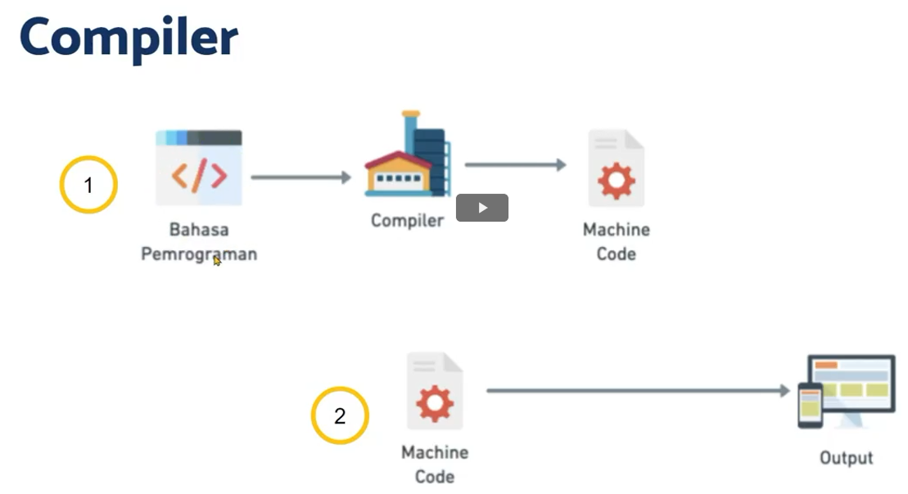

# (4) Introduction Mobile App Development

## Data diri:
### Nama: Akhmad Nur Alamsyah
### No urut:

<code><i>Mobile App Development</i> merupakan proses pengembangan aplikasi yang berjalan pada perangkat mobile. Dimulai dari desain, <i>development, testing</i>, sampai pada peluncuran aplikasi.</code>

## *Software*
*Software* merupakan perangkat lunak yang tersimpan dan dikendalikan pada sistem komputer. Perangkat tersebut terbentuk dari perintah-perintah yang terorganisir dan tidak memiliki bentuk fisik. 

## Jenis-Jenis *Sotware*
* Web
  * Diakses menggunakan *web browser* (Chrome, Mozilla, Safari)
  * Memerlukan *internet* untuk membukanya
* Desktop
  * Berjalan pada perangkat desktop
  * Umumnya perlu langkah instalasi
  * Dapat dibuka tanpa memerlukan internet
* Mobile
  * Berjalan pada perangkat mobile (smartphone atau tablet)
  * Umumnya perlu langkah instalasi
  * Dapat dibuka tanpa memerlukan internet

## Pengembangan *Software*
### Bahasa pemrograman
Rangkaian teks yang digunakan untuk memberi perintah kepada komputer.
### *Compiler*
*Software* yang digunakan untuk membaca perintah-perintah dalam bahasa pemrograman dan mengubahnya ke bahasa lain, biasanya ke dalam bentuk yang dikenali oleh komputer (*machine code*).
* Cara kerja *compiler*:

### *Interpreter*
*Software* yang digunakan untuk membaca perintah-perintah dalam bahasa pemrograman dan menjalankan langsung perintah-perintah tersebut.


## *Compiler* vs *Interpreter*
|*Compiler* | *Interpreter*
|---- |---- |
|Mengubah kode menjadi file yang dapat dijalankan |Membaca kode tanpa mengubah ke bentuk lain|
|Prosesnya lebih panjang |Prosesnya lebih singkat|
|Program dapat dijalankan dengan cepat karena tidak membaca ulang kode |Seringkali lebih lambat karena harus membaca ulang keseluruhan kode|

## *Mobile App Development*
Proses pengembangan aplikasi untuk perangkat mobile.
### IOS
* Berjalan pada sistem operasi iOS
* Perangkat hanya dikembangan oleh Apple
* Bahasa pemrograman native iOS adalah swift dan objective C

### Android
* Berjalan pada sistem operasi Android.
* Dikembangkan secara *open source*.

### Tahapan
```
Bahasa pemrograman -> Compiler -> Machine code (.apk/.ipa) -> Output
```