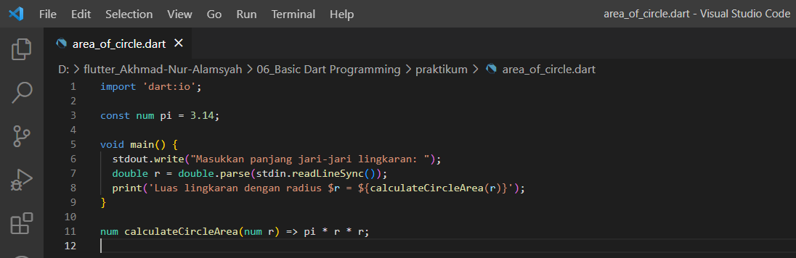
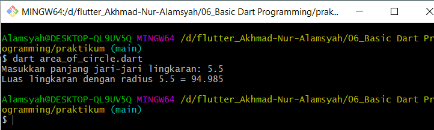
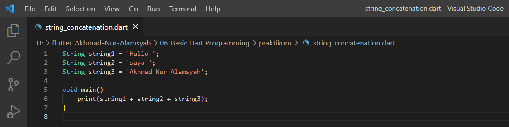
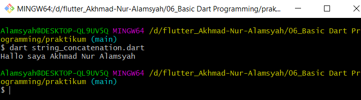

# (06) Basic Dart Programming (practical explanation)

## Nama: Akhmad Nur Alamsyah
&nbsp;
1. Implementasikan rumus luas lingkaran pada program dart!

   

   1. Import dart:io agar dapat menggunakan stdout.write dan stdin.readLineSync.
   2. Buat variable konstanta bernama pi. Konstan digunakan karena nilai pi tidak akan berubah.
   3. stdout.in akan menampilkan teks pada terminal/console dan meminta inputan yang akan diterima melalui stdin.realLineSync.
   4. Variable r bertipe double yang akan menerima inputan.    
   5. Print menampilkan teks dan akan di *concate* dengan hasil arrow function calculateCircleArea dengan parameter r.
   6. Program akan menjalankan fungsi calculateCircleArea yang akan menghitung luas lingkaran dengan rumus pi x jari-jari(r) x jari-jari(r). 
   
   #### Hasil:
   

2. Buatlah 3 buah variabel yang berisi string, lalu sambungkan seluruh string tersebut, dan tampilkan pada layar!

   

   1. Membuat 3 variable bertipe String dengan langsung di *assign value* nya.
   2. *Concate*/menghubungkan *value* dari ketiga variable dengan operator (+).

   #### Hasil: 
   