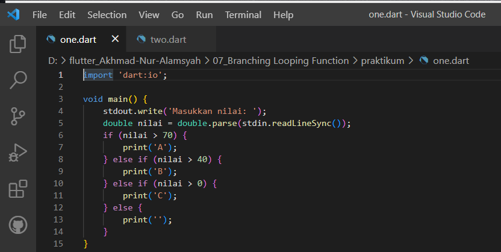
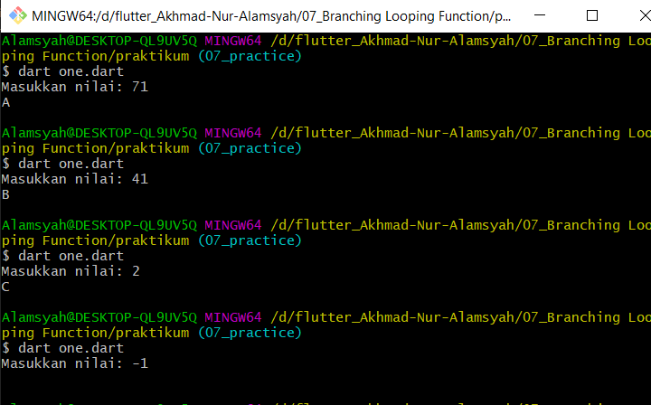
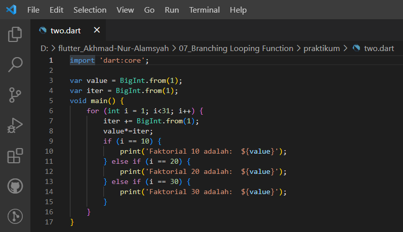
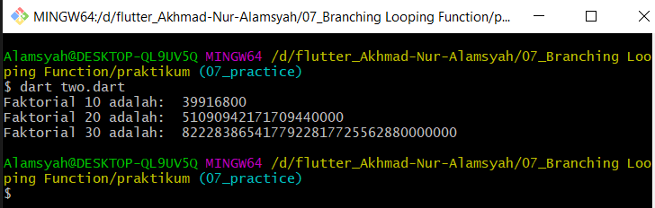

# **(07) Branching, Looping, Function (Practical Explanation)**

## Nama: Akhmad Nur Alamsyah

&nbsp;

1. Terdapat sebuah nilai:

    * Jika nilai > 70: return A
    * Jika nilai > 40: return B
    * Jika nilai > 0: return C
    * Selain itu return teks kosong

      

    1. Import dart.io agar bisa menggunakan stdout dan stdin.
    2. stdout.in akan menampilkan teks pada terminal/console dan meminta inputan yang akan diterima melalui stdin.realLineSync.
    3. Buat variable bernama nilai yang akan menerima inputan dari *user*.
    4. Buat operasi *conditional*/keputusan berupa if, else if, dan else dan operasi *comparison* yang akan menampilkan hasil sesuai dengan ketentuan soal. Teks akan ditampilkan jika nilai boolean nya true.
    5. Jika nilai boolean pada if bernilai true maka akan dijalankan, jika tidak maka pengecekan akan dilanjutkan pada kondisi else if.
    6. Jika tidak ada kondisi terpenuhi, maka akan menampilkan teks pada kondisi *else*.

    &nbsp; 
    
    * Hasil:
      

2. Tampilkan nilai faktorial dari:

    * 10
    * 20
    * 30

      

    1. Import dart:core untuk menggunakan big integer (BigInt).
    2. Buat variable bernama value dan iter yang bertipe BigInt dan bernilai awal 1.
    3. Menggunakan BigInt karena integer pada dart hanya maksimal 64 bit sehingga agar bisa menampilkan hasil perhitungan faktorial 30 dengan benar dibutuhkan big integer.
    4. Buat perulangan for dan inisiasi variable i yang memiliki nilai awal 1, i tidak boleh bernilai lebih dari 31, dan nilai i akan di *increment*.
    5. Tiap *iterasi* nilai terbaru variable iter akan dijumlahkan 1.
    6. Tiap *iterasi* nilai terbaru variable value akan  dikalikan dengan nilai variable iter.
    7. Dilakukan operasi *conditional*/keputusan if dan else if dan operasi *comparison*.
    8. Program menampilkan hasil berdasarkan operasi *conditional* dan *comparison*.

    &nbsp;

    * Hasil:
      