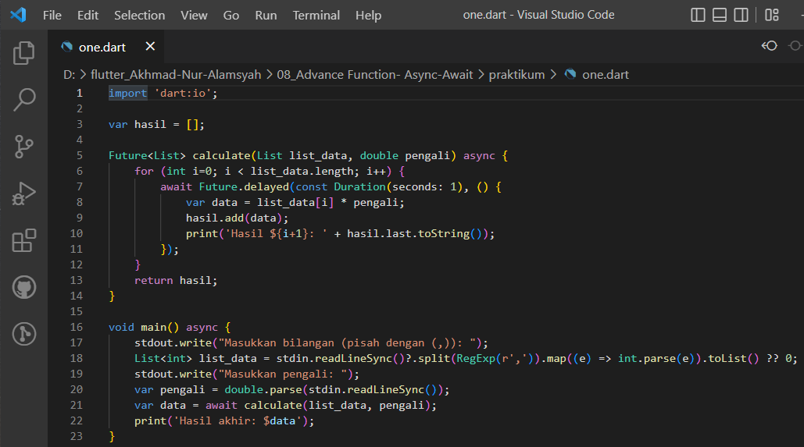
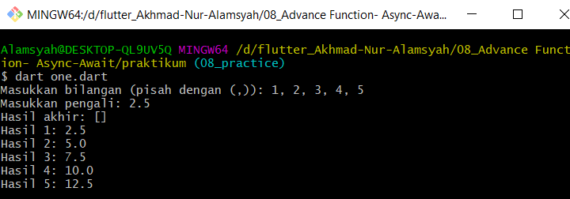
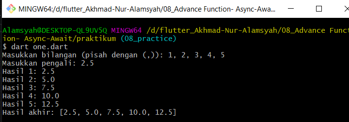
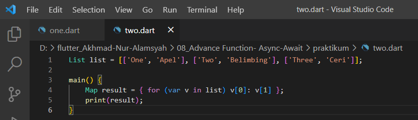
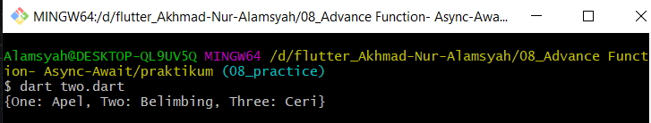

# (08) Advance Function - Async-Await (Practical Explanation)

## Name: Akhmad Nur Alamsyah
&nbsp;

1. Buatlah sebuah fungsi dengan spesifikasi berikut:

    * menerima 2 parameter, yaitu list data dan pengali.
    * lakukan perulangan pada list data dan pengali.
    * tiap perulangan, kalikan elemen list data dengan pengali.
    * *return* list baru yang berisi hasil proses di atas.

    

    ### **Penjelasan**
    * Import dart:io untuk menggunakan stdin dan stdout.
    * Membuat variable bertipe list dengan nama hasil.
    * Buat fungsi asynchronus bertipe Future List bernama calculate yang menerima 2 parameter bertipe List dan double.
    * Didalam fungsi calculate terdapat perulangan for dan inisiasi variable i yang memiliki nilai awal 1, i tidak boleh bernilai lebih dari panjang list list_data (argument list_data), dan nilai i akan di *increment*.
    * Tiap perulangan akan dilakukan koputasi *delay* selama 1 detik dengan menggunakan Future.delayed.
    * Menggunakan *keyword* await agar program menunggu komputasi *delay* tiap perulangan.
    * Tiap perulangan akan mengkalikan elemen list_data dengan pengali dan hasilnya akan ditambahkan kedalam variable data.
    * Nilai variable data akan ditambahkan kedalam variable hasil.
    * Fungsi *calculate* akan me-*return* list hasil yang berisi hasil perhitungan.
    * Program akan menampilkan hasil perhitungan tiap element secara berangsur-angsur setiap 1 detik.
    * Fungsi main dibuat menjadi asynchronus.
    * Program akan meminta inputan dari user untuk kemudian dimasukkan kedalam variable list_data. Inputan berisi 1 atau lebih angka yang dipisahkan dengan koma (,) yang nantinya akan di *split*/dipisahkan berdasarkan koma tersebut. Inputan di *mapping* kemudian dibuat arrow function yang akan melakukan *parsing* inputan tersebut menjadi bertipe integer dan kemudian disimpan ke dalam variable list_data dengan struktur data list. Jika user tidak menginputkan apapun maka variable list_data akan menyimpan 0.
    * Program akan meminta inputan lagi untuk pengali dan inputan di *parsing* menjadi bertipe double dan disimpan pada variable pengali.
    * Dijalankan fungsi *calculate* dengan argument list_data dan pengali yang telah diinputkan oleh user dengan *keyword* await agar program menunggu seluruh komputasi fungsi *calculate* selesai dan kemudian hasilnya disimpan pada variable data.
    * Program akan menampilkan hasil perhitungan secara berangsur-angsur tiap element tiap detik dan juga akan menampilkan seluruh hasil akhir dalam bentuk list jika seluruh komputasi fungsi *calculate* sudah selesai.

    * Hasil jika program dijalankan secara synchronous:
    

    * Hasil program asynchronous:
    
2. Buatlah sebuah list dengan spesifikasi berikut:

    * tiap element-nya berupa list juga.
    * tiap element wajib terdapat 2 data (sub-element).
    * Buatlah sebuah Map dengan menggunakan list tersebut!

    
    
    * Buat list of list bernama list dan tiap elemen dari list memiliki 2 data (sub-element).
    * Untuk mengubah element pertama dari sub-element menjadi key dan element kedua dari sub-element menjadi value dengan perulangan for in dengan cara for loop inline yang mana variable v akan menyimpan sementara (tidak benar-benar menyimpan value) tiap element dari variable list (contoh: ['One', 'Apel'], ['Two', 'Belimbing']), kemudian hasil tiap perulangan akan disimpan kedalam variable bertipe Map dengan nama result dengan format v[0] (element sementara indeks 0 variable v di tiap loop) akan menjadi key, dan v[1] (element sementara indeks 1 variable v di tiap loop) akan menjadi value. 

    * Hasil:
    