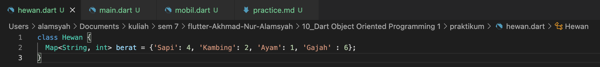
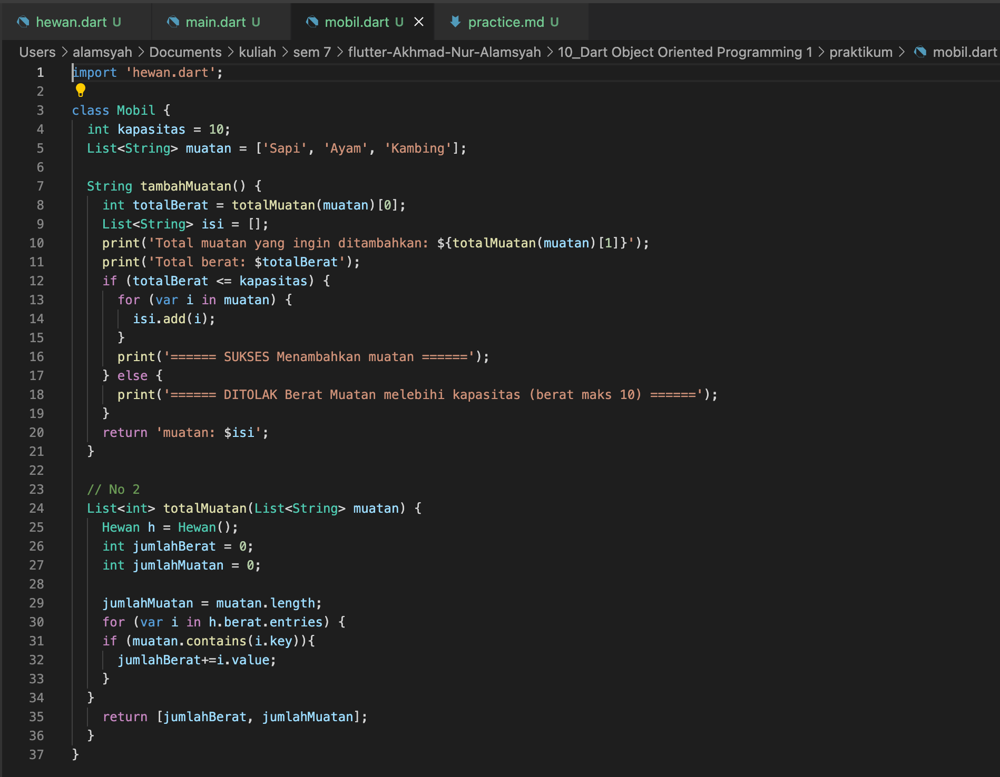
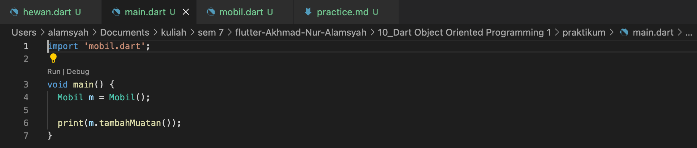
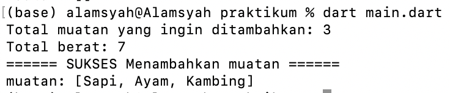
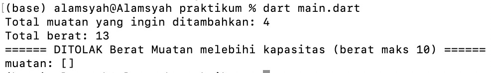

# (10) Dart Object Oriented Programming 1 (Practical Explanation)
&nbsp;

* Class Hewan
 
 Pada class Hewan hanya terdapat satu attribut bernama berat bertipe Map dengan key bertipe String dan value bertipe integer. Attribut berat ini  berisi berat tiap hewan.

* Class Mobil

Class mobil memiliki attribut kapasitas bertipe integer, berfungsi untuk menentukan batas maksimum berat muatan mobil. Kemudian attribut muatan bertipe List of String berisi hewan apa saja yang akan dimasukkan/dimuat pada mobil. Ada juga method tambahMuatan, method ini berfungsi untuk melakukan pengecekan apakah muatan bisa dimuat oleh mobil dengan cara pengecekan apakan berat muatan tidak melebihi kapasitas. Jika berat muatan tidak melebihi kapasitas maka muatan dapat dimuat oleh mobil, jika melebihi maka akan ditolak. Jika muatan dapat dimuat maka akan dimasukkan ke dalam list isi dan akan ditampilkan isinya.

    Pada class Mobil juga terdapat method totalMuatan (soal no 2). Method ini berfungsi untuk menghitung jumlah muatan dan juga berat total muatan. Didalam method totalMuatan ini terdapat pengecekan apa saja isi muatan yang terdapat pada daftar berat yang ada pada variable map pada class Hewan untuk kemudian didapatkan beratnya dan dilakukan perhitungan jumlah muatan dan juga berat total muatan. Method totalMuatan mereturn list hasil perhitungan jumlah muatan dan juga berat total muatan untuk kemudian hasilnya akan digunakan pada method tambahMuatan.

Pada class Main hanya membuat objek dari class Mobil dan memanggil/menjalankan method tambahMuatan.

### Hasil jika berat muatan tidak melebihi kapasitas maksimal.

### Hasil jika berat muatan melebihi kapasitas maksimal.

