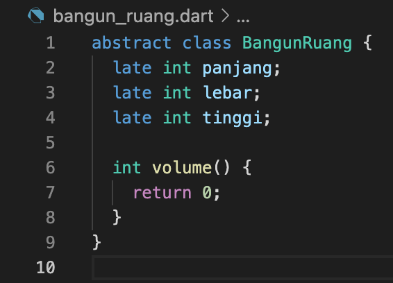
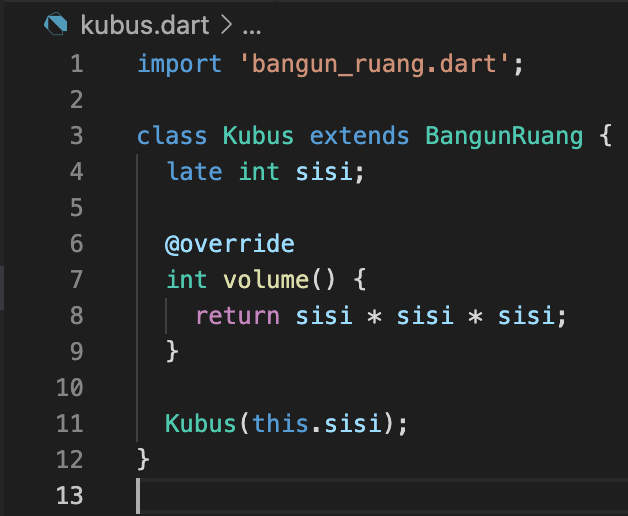
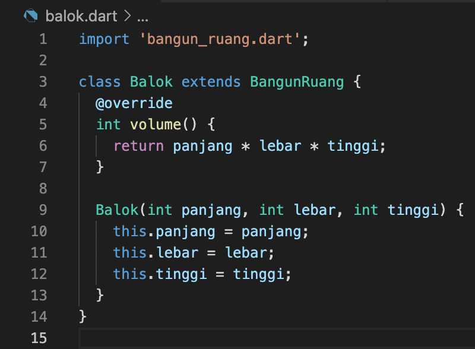
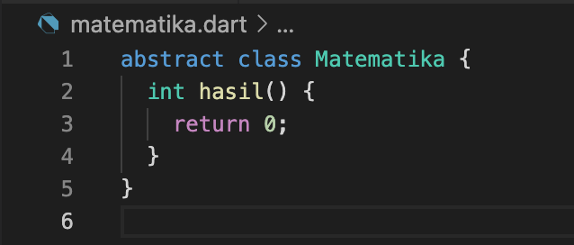
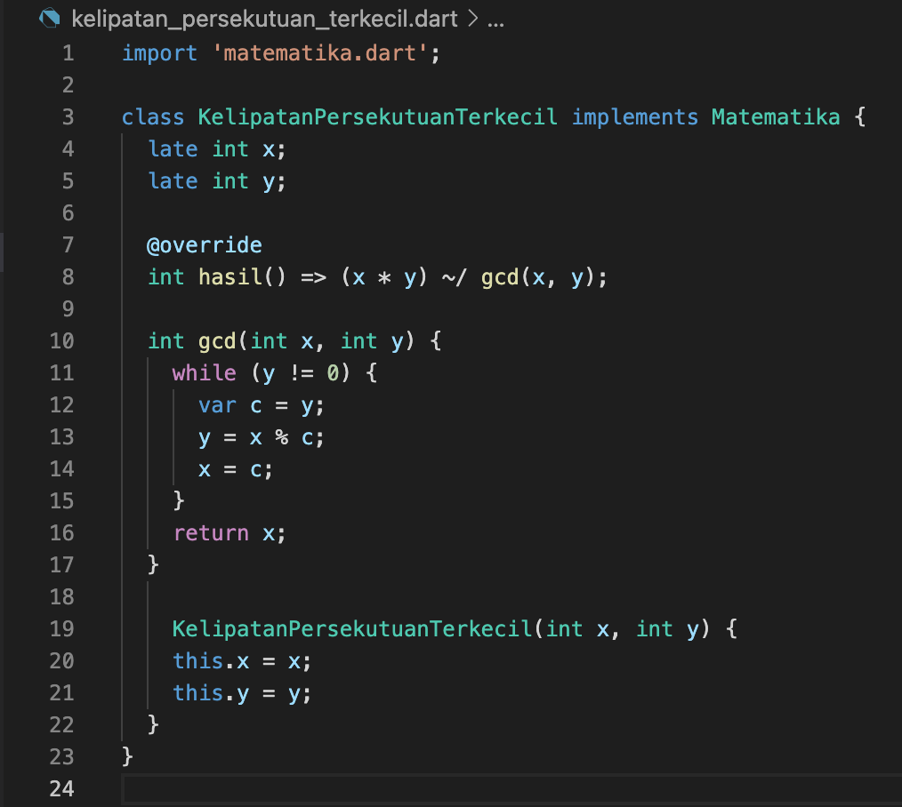
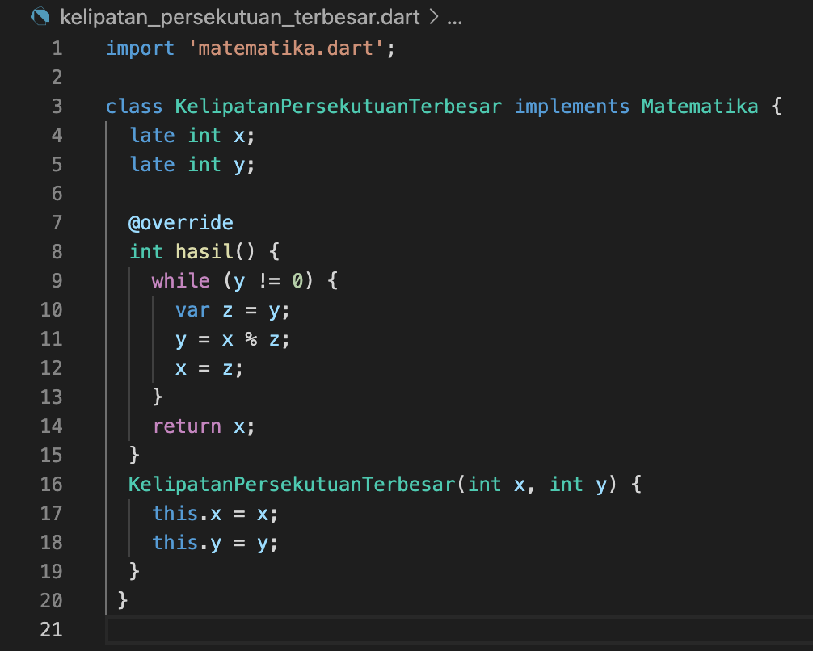
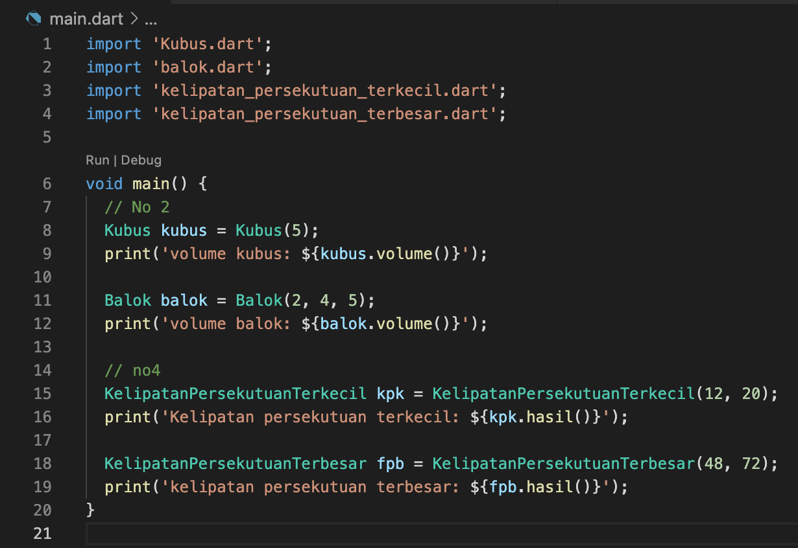
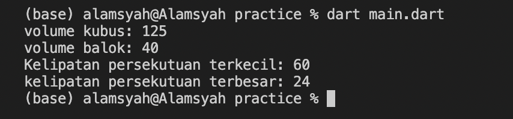

# (11) Dart Object Oriented Programming 2 (Practical Explanation)

## Nama: Akhmad Nur Alamsyah
&nbsp;

## Class BangunRuang

### Class BangunRuang adalah class abstract yang berisi attribut panjang, lebar, dan tinggi, dan juga terdapat method volume yang nantinya akan di override oleh subclass.
&nbsp;

## Class Kubus

### Class Kubus meng-*inherit*/mewarisi class BangunRuang dengan menggunakan *keyword* extends. Pada class Kubus ini terdapat satu attribut baru bernama sisi yang akan diisi value belakangan melalui constructor. Class Kubus memiliki *method* volume yang meng-*override method* volume pada class BangunRuang akan tetapi dengan implementasi dan return yang berbeda. Method volume pada class Kubus akan mengimplementasikan rumus volume kubus.
&nbsp;

## Class Balok

### Class Balok meng-*inherit*/mewarisi class BangunRuang dengan menggunakan *keyword* extends. Class Kubus memiliki *method* volume yang meng-*override method* volume pada class BangunRuang dengan implementasi rumus volume balok yaitu panjang x lebar x tinggi yang valuenya diambil melalui constructor. 
&nbsp;

## Class Matematika

### Class Matematika merupakan class abstract yang hanya berisi fungsi hasil. Class Matematika ini nantinya akan di-implement oleh sub-classnya dan method hasil akan di-override oleh subclassnya.
&nbsp;

## Class KelipatanPersekutuanTerkecil

### Class KelipatanPersekutuanTerkecil mengimplement class Matematika. Pada class ini terdapat attribut baru yaitu x, dan y yang valuenya akan diisi belakangan melalui constructor. Selain itu, didalam class ini juga terdapat method gcd dan hasil yang berisi rumus kelipatan persekutuan terkecil. Method hasil meng-override method hasil pada class Matematika. 
&nbsp;

## Class KelipatanPersekutuanTerbesar

### Class KelipatanPersekutuanTerbesar mengimplement class Matematika. Pada class ini terdapat attribut baru yaitu x, dan y yang valuenya akan diisi belakangan melalui constructor. Selain itu, terdapat method hasil yang meng-override method hasil pada class Matematika dan berisi rumus kelipatan persekutuan terkecil.
&nbsp;

## Class Main

### Pada class Main ini hanya membuat objek sekaligus mengisi argument constructor dan kemudian menjalankan method menggunakan objek tersebut dan menampilkannya menggunakan fungsi print.
&nbsp;

## Hasil
