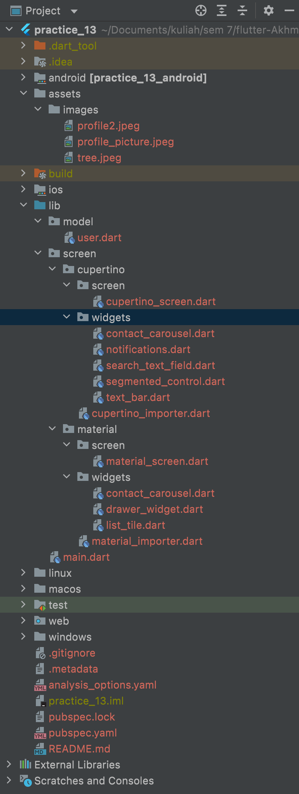
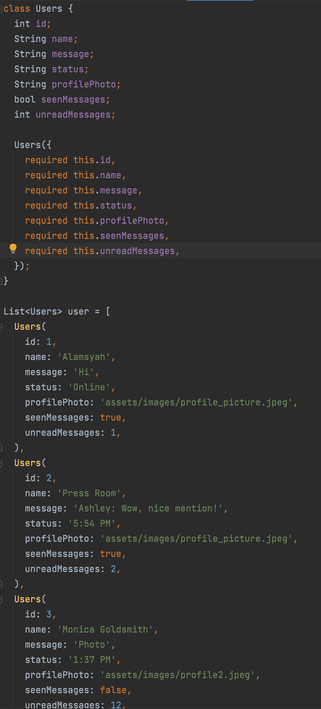
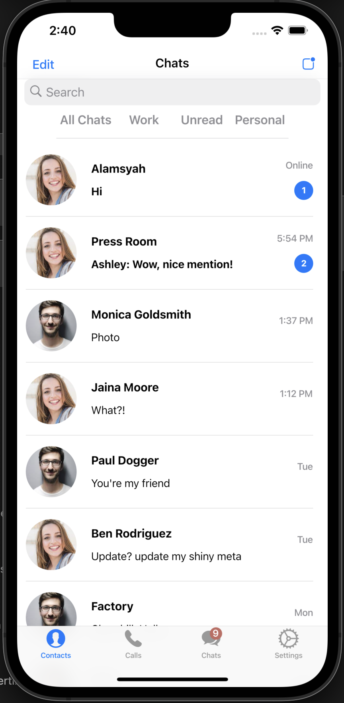
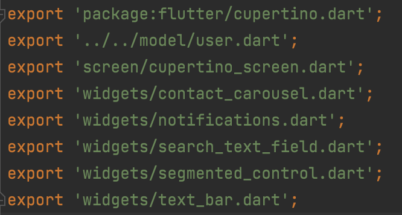
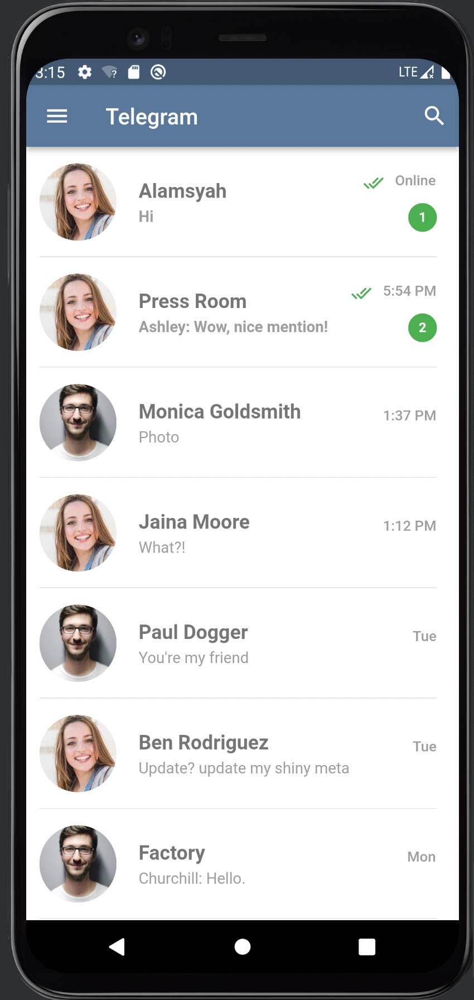
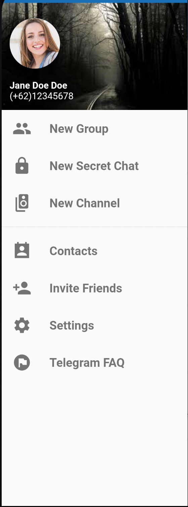
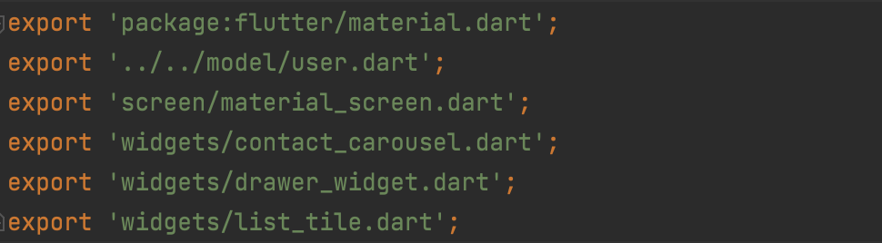
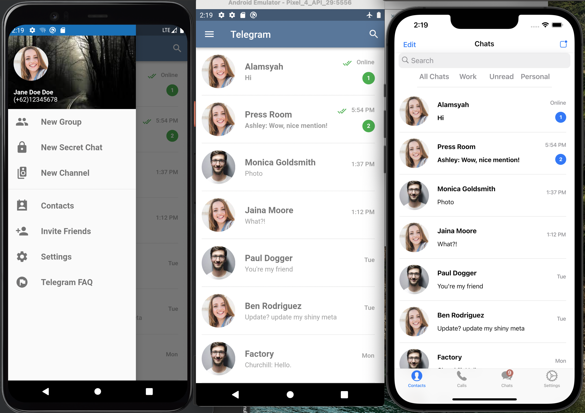

# **(13) Platform Widget (Practical Explanation)**

## Nama: Akhmad Nur Alamsyah
&nbsp;

# **Project Structure**

## Folder assets
Pada folder assets terdapat folder lagi bernama images yang berisi 3 gambar.

## Folder lib
Pada folder lib terdapat 2 folder lain yaitu model dan screen yang akan dijelaskan selanjutnya.

## Folder model
Didalam folder model terdapat satu file dart bernama model yang berisi data user yang akan digunakan pada aplikasi.

&nbsp;

# **Cupertino**

## Folder screen 
Pada folder screen terdapat dua folder bernama cupertino dan material yang didalamnya terdapat beberapa file lagi.

## Folder cupertino
Pada folder cupertino terdapat:
* Folder screen 
    #### Berisi file dart bernama cupertino_screen dan class CupertinoScreen akan di-return oleh fungsi MyApp pada file main.dart dan akan menampilkan halaman:
    
* Folder widgets
    #### Berisi berbagai custom widget yang digunakan pada aplikasi seperti:
    * ContactCarousel

        
    
    * Notifications

        

    * SearchTextField

        

    * SegmentedControl dan TextBar

        

## cupertino_importer.dart
Berisi package dan file-file yang dibutuhkan oleh Cupertino App sehingga tiap file hanya perlu meng-import file cupertini_importer.dart.

&nbsp;

# **Material**

* Folder screen 
    #### Berisi file dart bernama material_screen dan class MaterialScreen akan di-return oleh fungsi MyApp pada file main.dart dan akan menampilkan halaman:

## Folder material
Pada folder material terdapat:
* Folder screen 
    #### Berisi file dart bernama material_screen dan class MaterialScreen akan di-return oleh fungsi MyApp pada file main.dart dan akan menampilkan halaman:
    

* Folder widgets
    #### Berisi berbagai custom widget yang digunakan pada aplikasi seperti:
    * ContactCarousel

        
    
    * DrawerWidget

        

    * ListTileWidget

        

## material_importer.dart
Berisi package dan file-file yang dibutuhkan oleh Cupertino App sehingga tiap file hanya perlu meng-import file cupertini_importer.dart.

## Hasil 

