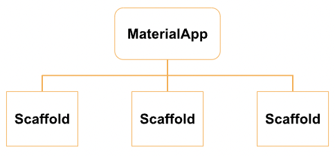
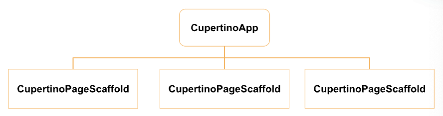

# (13) Platform Widget

## Nama: Akhmad Nur Alamsyah
&nbsp;

<code>Memanfaatkan widget dengan gaya berbeda pada tiap platform.</code>
&nbsp;

## MaterialApp
MaterialApp merupakan widget dasar yang mengemas seluruh widget dalam aplikasi. MaterialApp digunakan pada sistem Android. Di-import dari <code>package:flutter/material.dart</code>.

### Struktur
Widget yang pertama kali dibuka, diletakkan pada bagian home.
```
MaterialApp(
    home: const HomePage(),
);
```
&nbsp;

## Scaffold
Scaffold merupakan widget dasar untuk membangun sebuah halaman pada MaterialApp.



### Struktur
Membentuk tata letak dasar sebuah halaman yang ditulis melalui properti-properti.
```
Scaffold(
    appBar: AppBar(...),
    drawer: Drawer(...),
    body: ...,
);
```

## CupertinoApp
CupertinoApp merupakan widget dasar yang mengemas seluruh widget dalam aplikasi. CupertinoApp digunakan pada sistem iOS. Di-import dari <code>package:flutter/cupertino.dart</code>.

### Struktur
```
final _themeDark = const CupertinoThemeData.raw(
    Brightness.dark,
);
```

Variable _themedark dibuat untuk menyimpan tema. Diperlukan karena Cupertino tidak menyediakan ThemeData.dark() seperti pada Material.

```
CupertinoApp(
    theme: _themeDark,
    home: const HomePage(),
);
```

## CupertinoPageScaffold
CupertinoPageScaffold merupakan widget dasar untuk membangun sebuah halaman pada CupertinoApp.


### Struktur
Membentuk tata letak dasar sebuah halaman yang ditulis melalui properti-properti.
```
CupertinoPageScaffold(
    navigationBar: CupertinoNavigationBar(...),
    child: ...,
);
```

