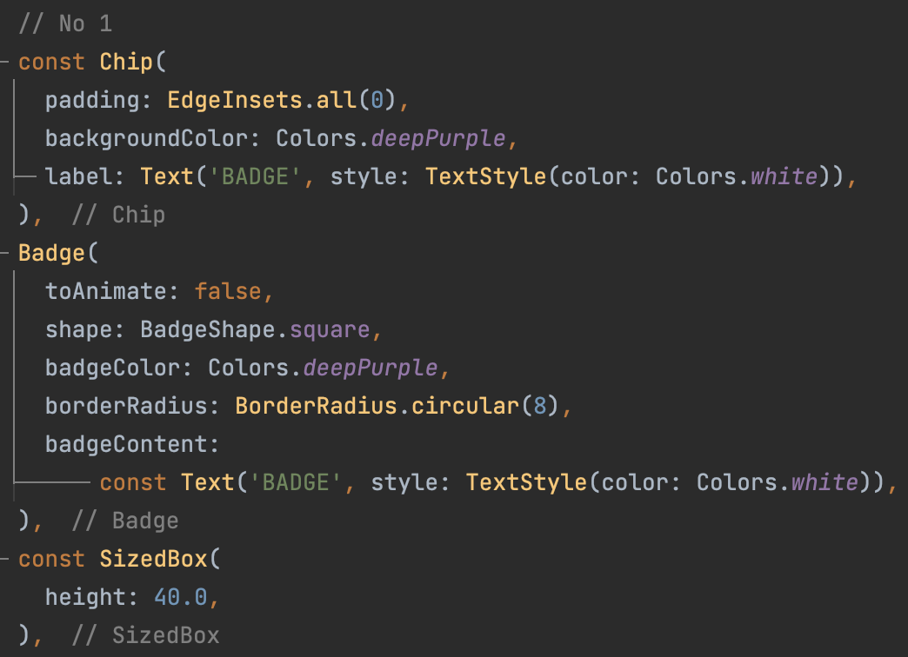
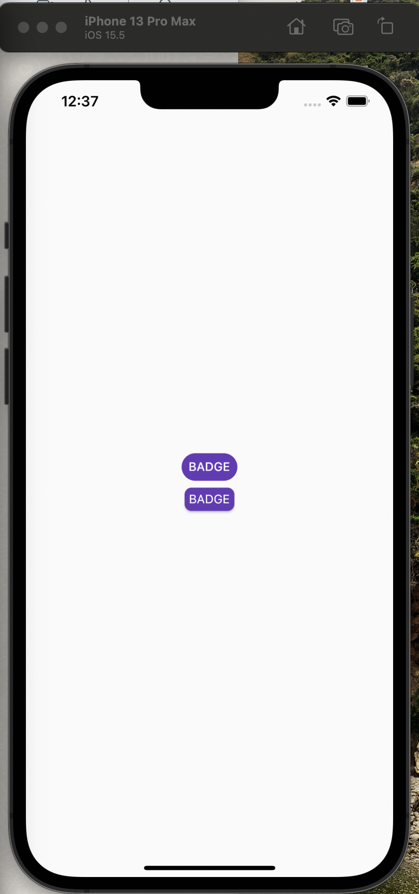
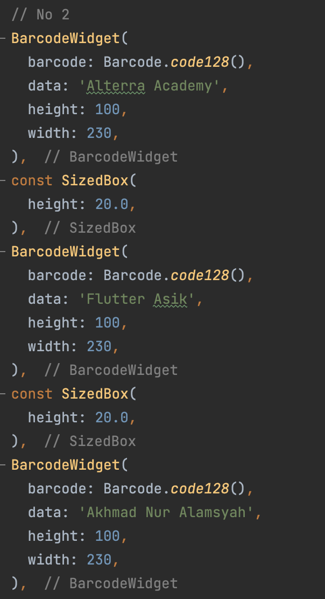
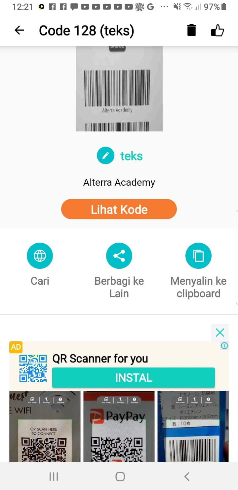
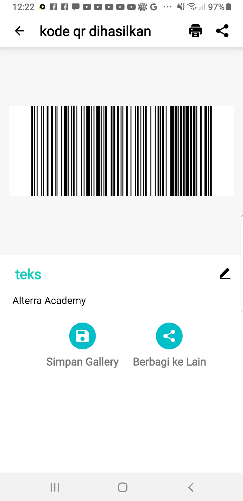
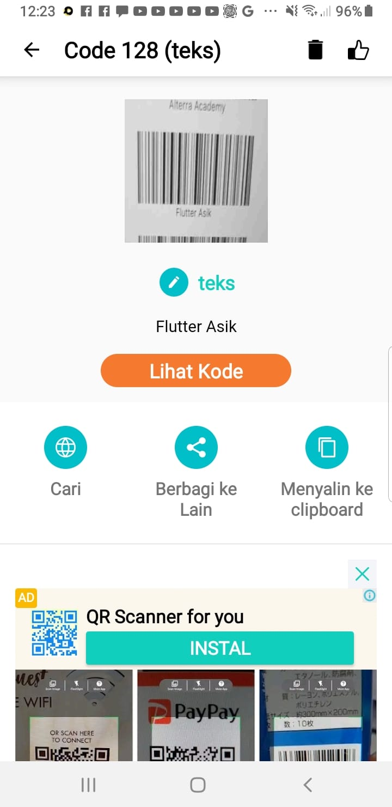
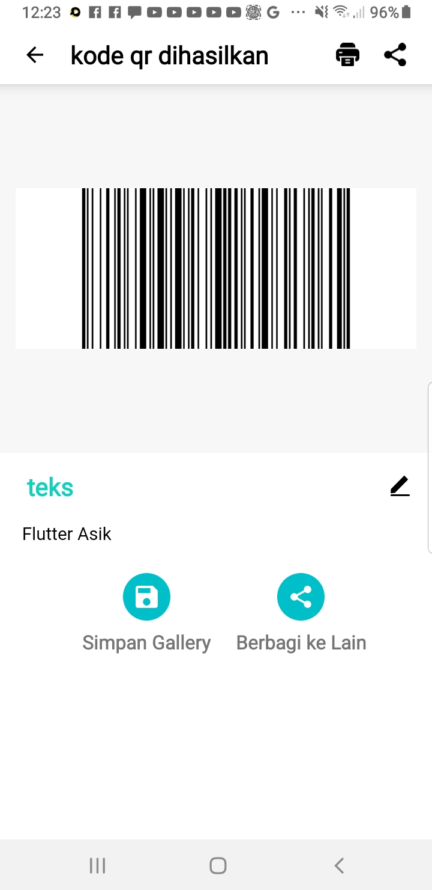
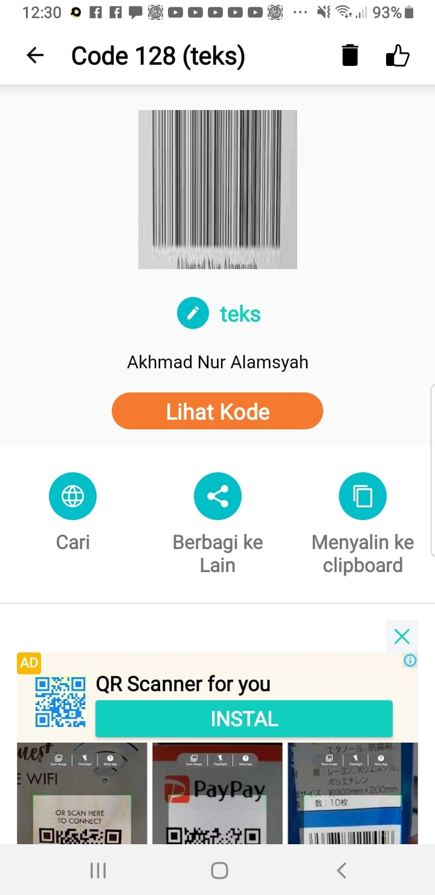
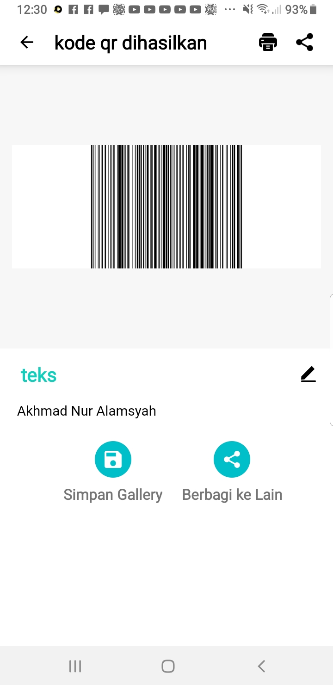
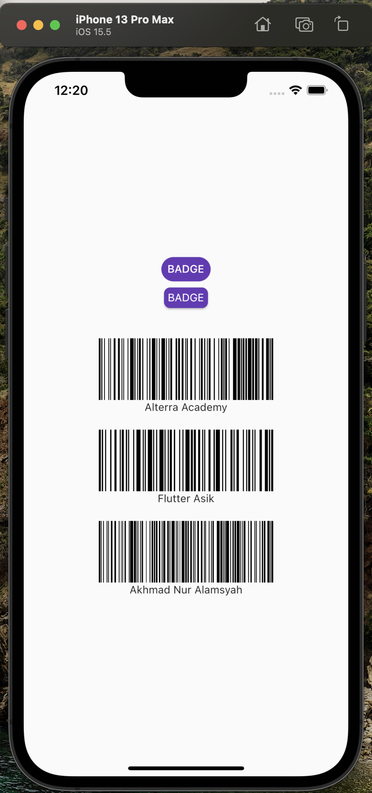

# **(14) Flutter Command Line Interface (CLI) and Flutter Package Management (Practical Explanation)**

## Nama: Akhmad Nur Alamsyah
&nbsp;

# No 1

### code:

### Menggunakan package <a href=https://pub.dev/packages/badges>badges</a>. Jalankan <code>flutter pub add badges</code> pada terminal. Import package pada file dart yang akan menggunakan widget pada package agar bisa digunakan. Buat dua widget (Chip dan Badge) yang masing-masing memiliki teks 'BADGE' dan berwarna deep purple. 
### Hasilnya menjadi:

&nbsp;

# No 2

### Menggunakan package <a href=https://pub.dev/packages/barcode_widget>barcode_widget</a>. Jalankan <code>flutter pub add barcode_widget</code> pada terminal. Import package pada file dart yang akan menggunakan widget pada package agar bisa digunakan. Buat 3 widget BarcodeWidget dengan argument untuk parameter barcode menggunakan Barcode.code128, data yang berbeda tiap widget dan atur ukuran widget. 
### Hasil ketika di scan:

### Tampilan aplikasi:
