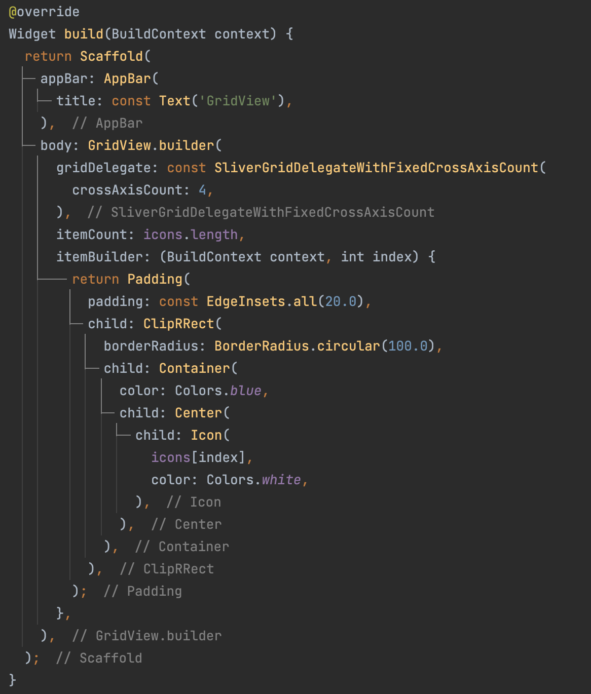
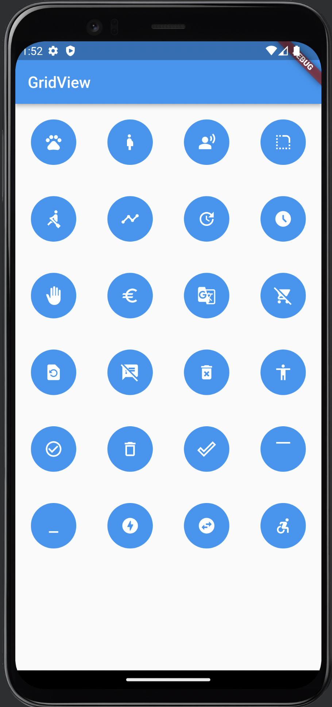

# **(15) Flutter Layout (Practical Explanation)**

## Nama: Akhmad Nur Alamsyah
&nbsp;

# No 1

## Model

Model atau data yang digunakan pada ListView. Class Users memiliki attribut id, profileText, name, dan number. Dan berisi list of Users bernama user. 

&nbsp;

## ListView Code
Menggunakan ListView.builder dengan scrollDirection vertikal dan berjumlah sejumlah banyaknya data pada model. Kemudian terdapat itemBuilder yang akan membuat ListTile sejumlah jumlah data yang tersedia dan menampilkan datanya pada leading (sebelum title), dan title (tengah).

## Hasil:

&nbsp;

# No 2

## GridView Code

Menggunakan GridView.builder dengan gridDelegate SliverGridDelegateWithFixedCrossAxisCount dengan jumlah crossAxisCount (row) berjumlah 4, jumlah item 32, dan juga membuat itemBuilder yang akan membuat widget didalamnya sejumlah banyak item.
&nbsp;

## Hasil:

