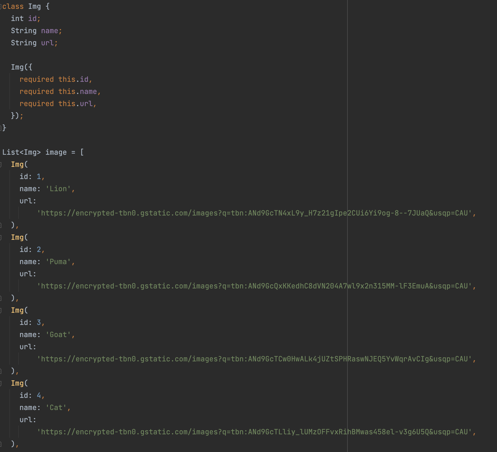
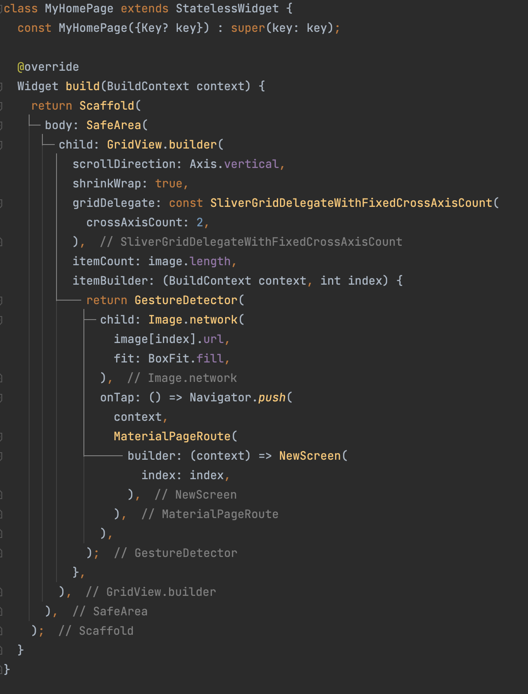
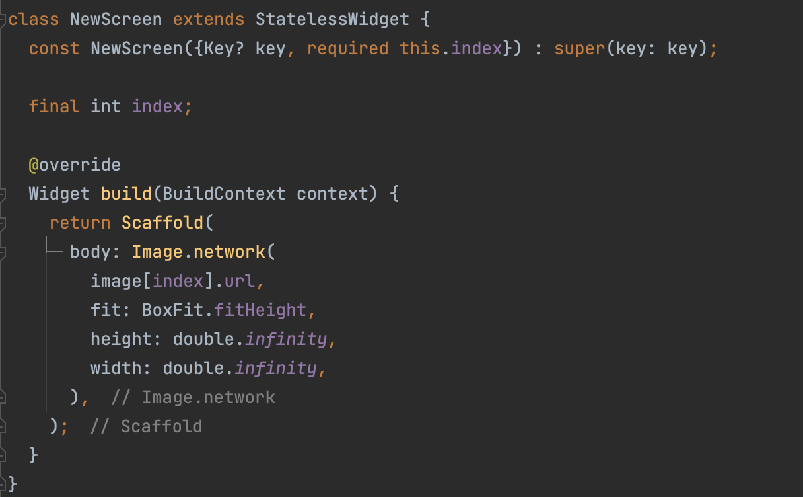
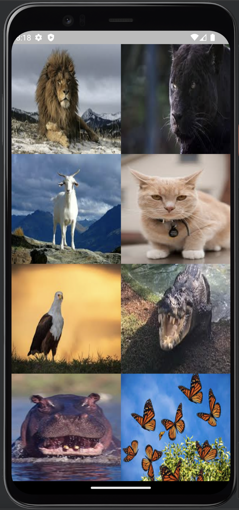
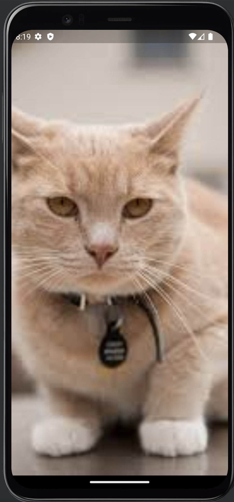

# **(14) Assets (Practical Explanation)**

## Nama: Akhmad Nur Alamsyah
&nbsp;

## Model 

Model yang digunakan pada aplikasi termasuk link gambar di internet.

&nbsp;

## HomePage

Gridview.builder untuk menampilkan menampilkan gambar dari internet (Image.network). Setiap gambar jika ditekan (menggunakan GestureDetector) maka akan menuju layar baru yang berisi gambar tersebut secara full (BoxFit.fill).

&nbsp;
## New Screen

Menggunakan Image.network untuk menampilkan gambar dari internet secara full berdasarkan model menggunakan BoxFit.fitHeight, height dan width infinity.

&nbsp;
## Hasil

