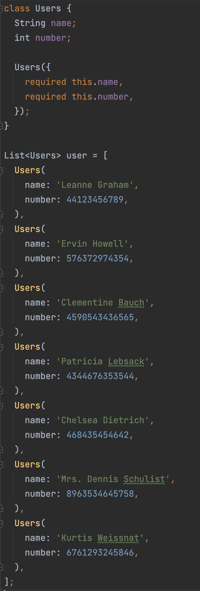
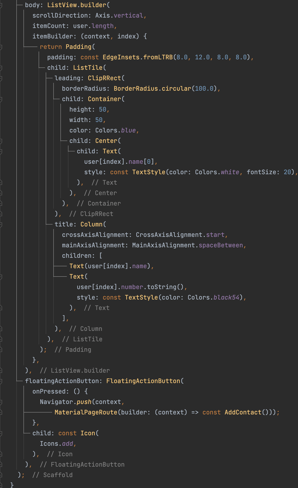
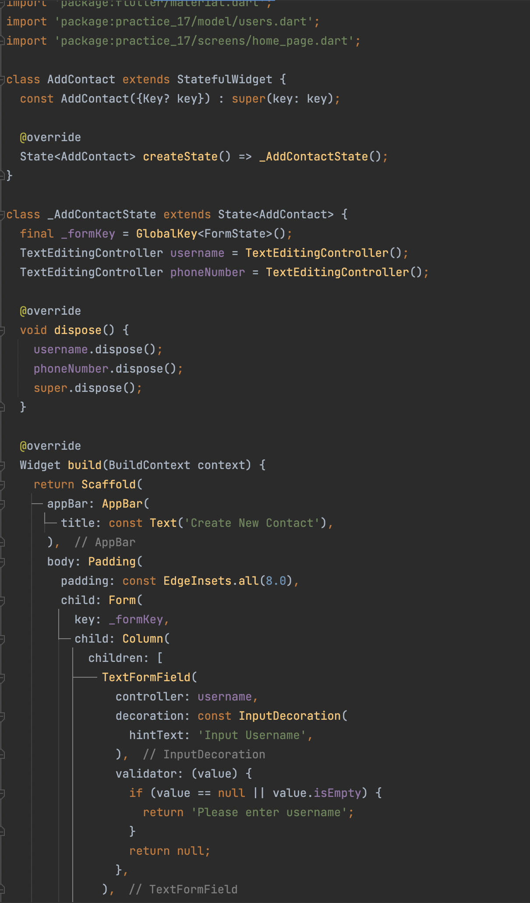

# **(17) Form Input Button (Practical Explanation)**

## Nama: Akhmad Nur Alamsyah
&nbsp;

# Model

Pada class Users memiliki attribut name, dan number. Kemudian terdapat list of object Users bernama user yang akan menjadi data pada aplikasi.

# HomePage

Pada class HomePage (akan ditampilkan pertama saat aplikasi dibuka) akan berisi ListTile yang berisi data dari list user. Akan menampilkan nama dan juga nomor telepon. Kemudian terdapat tombol yang akan menuju halaman add contact untuk menambahkan contact (menambah objek pada list user). 

&nbsp;
# AddContact

Pada halaman add contact terdapat Form yang berisi TextFormField untuk menginputkan username dan number (phone number) dengan validator tidak boleh kosong. Kemudian terdapat tombol submit yang akan mengarahkan ke halaman contact dan juga akan menambahkan data yang dimasukkan menjadi objek Users dan ditambahkan kedalam list user dan ditampilkan pada halaman contacts.

&nbsp;
# Hasil

https://user-images.githubusercontent.com/61916375/193241165-5ffb8903-564f-48ac-b982-48a8a8460e74.mov

Sudah mengumpulkan tepat waktu tapi ketika push section baru ditolak (rejected) ketika di force push (git push -f origin branch) malah hilang video section 17 dan 18. Sudah bilang mas Ade. 
