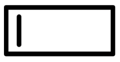
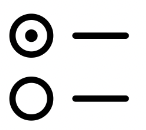
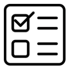
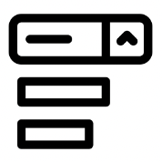
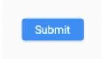
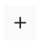

# **(17) Form Input Button**

## Nama: Akhmad Nur Alamsyah
&nbsp;

# Form
Form menerima isian data dari pengguna dan isian data dapat lebih dari satu. 

## Membuat Form
* Menggunakan StatefulWidget
* Keadaan form disimpan menggunakan GlobalKey<FormState>
    ```
    // property
    var formKey = GlobalKey<FormState>();

    // build
    Form(
        key: formKey,
        child: inputWidgets,
    );
    ```

# Input

## TextField



TextField menerima isian data dari pengguna dan isian data dapat lebih dari satu.

### Membuat TextField
* Data diambil menggunakan TextEditingController.
* Isian data berupa teks.
    ```
    // property
    var inputController = TextEditingController();

    // build
    TextField(
        controller: inputController,
    );
    ```

## Radio



Radio memberi opsi pada pengguna dan hanya dapat memilih satu opsi.

### Membuat Radio
* Data diambil menggunakan property dengan tipe data sesuai value pada radio.
    ```
    // property
    var radioValue = '';

    // build
    Radio<String>(
        value: 'Laki-Laki',
        groupValue: radioValue,
        onChanged: (String? value) {
            setState(() {
                radioValue = value ?? '';
            });
        },
    );
    ```

## Checkbox



Checkbox memberi opsi pada pengguna dan dapat memilih beberapa opsi.

### Membuat Checkbox
* Data diambil menggunakan property bertipe bool.
    ```
    // property
    var checkValue = false;

    // build
    Checkbox(
        value: checkValue,
        onChanged: (bool? value) {
            setState(() {
                checkValue = value ?? flase;
            });
        },
    );
    ```

## Dropdown Button



Dropdown button memberi opsi pada pengguna, hanya dapat memilih satu opsi, opsi tidak ditampilkan di awal, dan hanya tampil jika ditekan.

### Membuat DropdownButton
* Data diambil menggunakan property dengan tipe data sesuai value pada DropdownMenuItem.
    ```
    // property
    var dropdownValue = 0;

    // build
    DropdownButton(
        value: dropdownValue,
        onChanged: (int? value) {
            setState(() {
                dropdownValue = value ?? 0;
            });
        },
        items: const [
            DropdownMenuItem(
                value: 0,
                child: Text('Pilih ...'),
            ),
            DropdownMenuItem(
                value: 1,
                child: Text('Satu'),
            ),
            DropdownMenuItem(
                value: 2,
                child: Text('Dua'),
            ),
        ],
    );
    ```

# Button
Button bersifat seperti tombol dan dapat melakukan sesuatu saat ditekan.

## ElevatedButton
ElevatedButton merupakan tombol yang timbul.
```
ElevatedButton(
    child: const Text('Submit'),
    onPressed: () {
        // lakukan sesuatu
    },
);
```


## IconButton
IconButton merupakan tombol yang hanya menampilkan icon.
```
IconButton(
    icon: const Icon(Icons.add),
    onPressed: () {
        // lakukan sesuatu
    },
);
```
