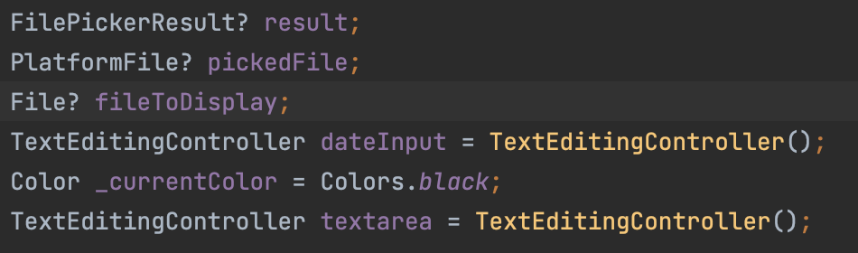
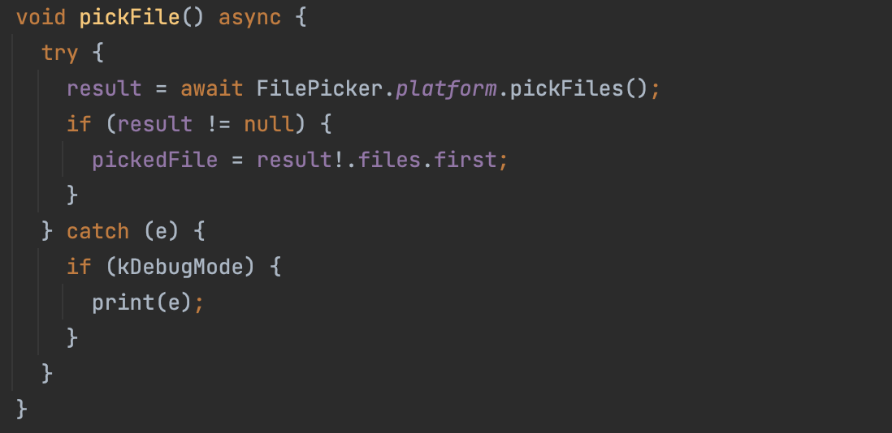
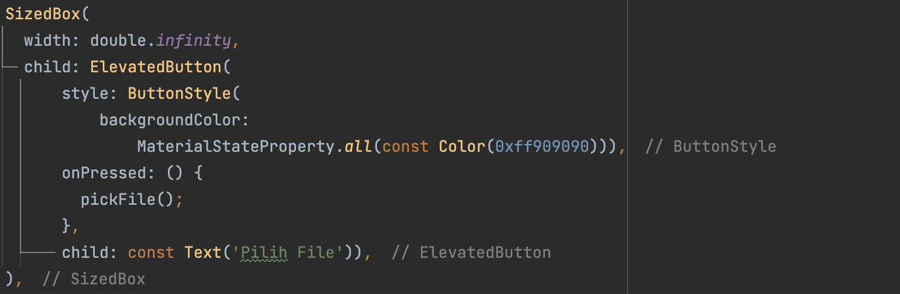
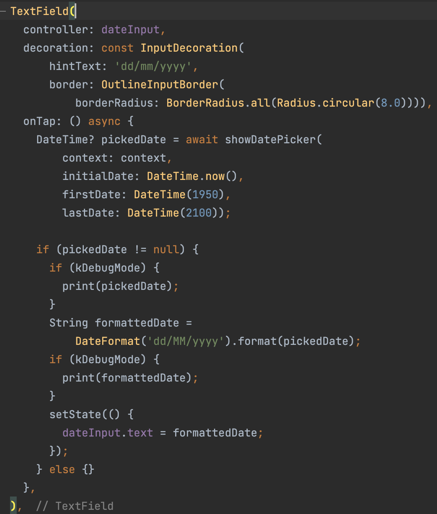
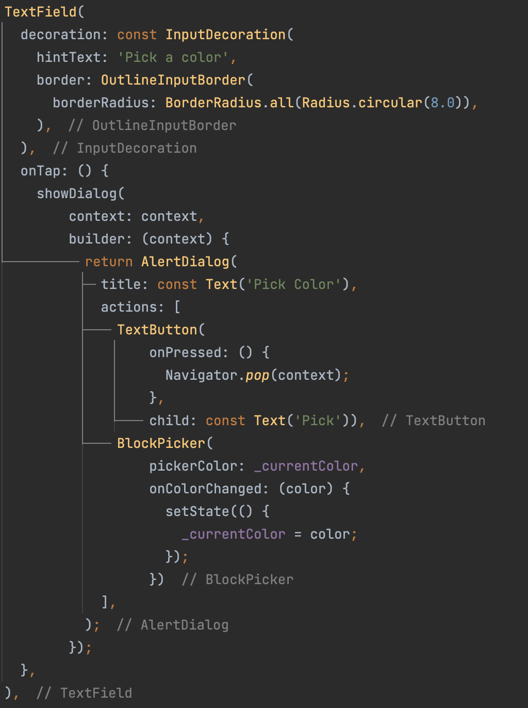
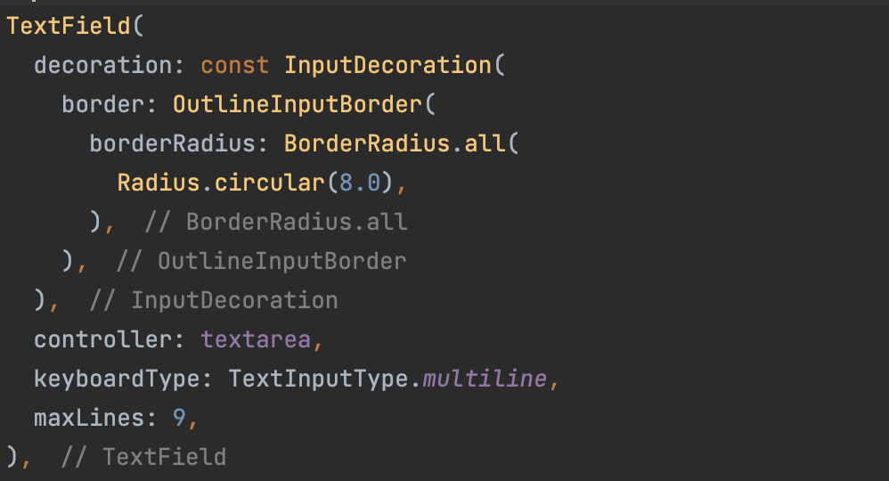
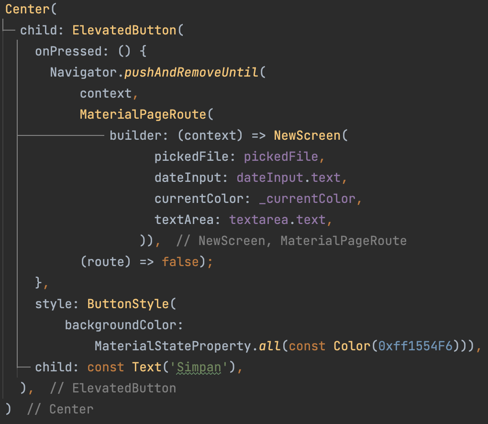
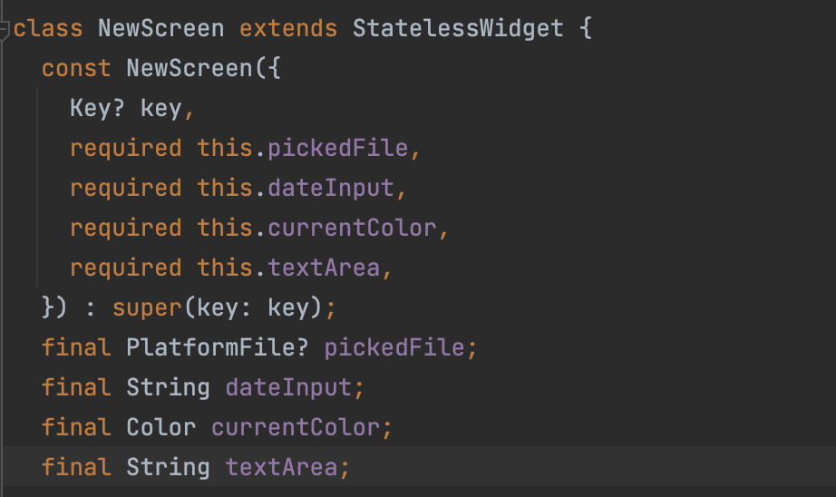
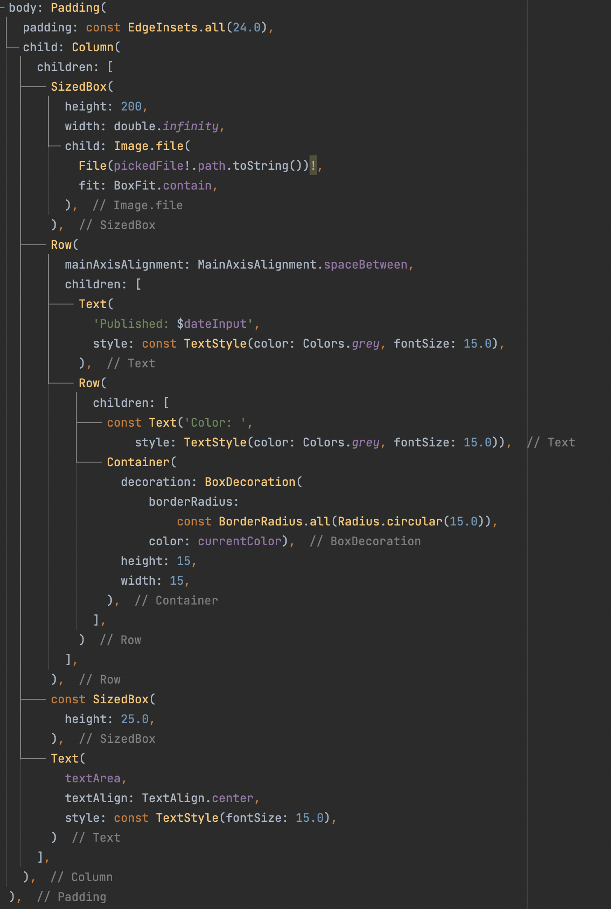
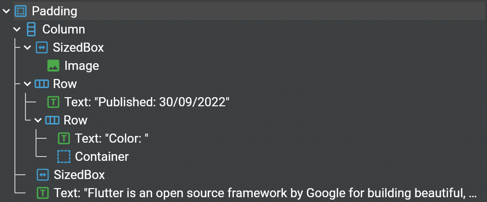

# **(18) Form Picker (Practical Explanation)**

## Nama: Akhmad Nur Alamsyah
&nbsp;

# Class HomePage
Class HomePage meng-extend StatefulWidget. Memiliki beberapa attribut seperti:

&nbsp;

attribut result, pickedFile, dan fileToDisplay untuk mengambi file (gambar), attribut dateInput untuk mengambil tanggal (date picker), _currentColor untuk mengambil warna (color picker), dan textArea untuk mengambil teks (string). 

&nbsp;

Fungsi pickFile digunakan untuk mengambil gambar yang memanfaatkan fungsi pickFiles dari dependency file_picker. Fungsi ini akan dijalankan ketika user menekan tombol 'Pilih File'.

&nbsp;

Tombol untuk memilih gambar menggunakan ElevatedButton. Ketika ditekan akan memanggil fungsi pickFile.

&nbsp;

Berfungsi untuk menginputkan tanggal memanfaatkan dependency intl dan menggunakan TextField. Memiliki batas tahun 1950 sampai tahun 2100. 

&nbsp;

Memanfaatkan dependency flutter_colorpicker dan menggunakan TextField yang ketika ditekan akan menampilkan pilihan warna yang dapat dipilih. 

&nbsp;

TextField yang memiliki maxLines 9 dan TextInputType.multiline sehingga memiliki bentuk lebih tinggi (height bukan hanya satu baris).  

&nbsp;

Tombol yang ketika ditekan akan menuju halaman NewScreen (class NewScreen) menggunakan Navigator puchAndRemoveUntil dan juga akan mengirimkan argument data berisi data dari attribut pickedFile, dateInput, _currentColor, dan textarea.

# NewScreen

Pada class NewScreen memiliki constructor dan empat attribut yang value-nya akan diterima dari argument dari class HomePage.

&nbsp

Pada class NewScreen ini hanya akan menampilkan data yang diterima dari class HomePage. Memiliki layout sebagai berikut:

&nbsp;

# Hasil