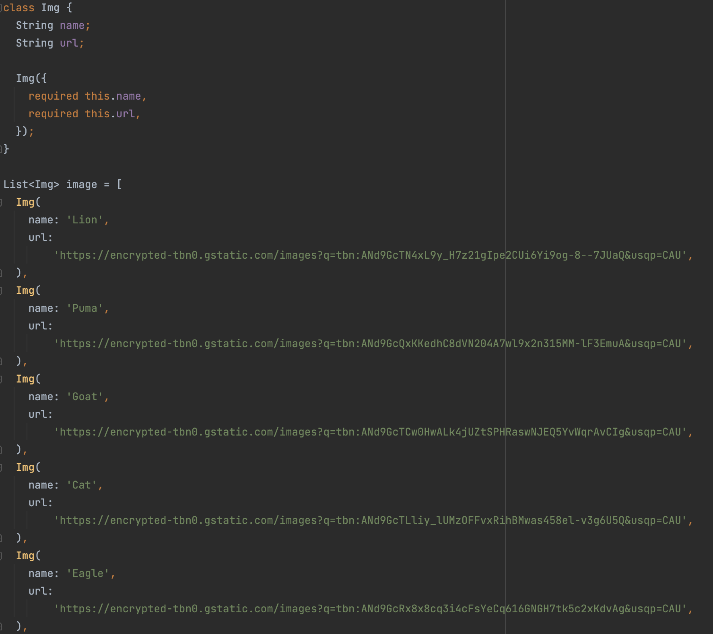

# **(19) Dialog Bottom Sheet (Practical Explanation)**

## Nama: Akhmad Nur Alamsyah
&nbsp;

## Model
Model data yang digunakan.



## Membuat gallery yang berisi gambar-gambar
Membuat gallery berisi gambar-gambar binatang dengan memanfaatkan model dan GridView.builder dengan gridDelegate SliverGridDelegateWithFixedCrossAxisCount dan crossAxisCount (row) sebanyak 3. Me-return Image.network (di-wrap dengan GestureDetector dan Padding) yang akan mengambil menampilkan gambar yang sumbernya dari url gambar internet dari model (list image) sesuai index. GestureDetector digunakan agar gambar dapat ditekan dan akan menampilkan bottom sheet.

Code:
```
GridView.builder(
    scrollDirection: Axis.vertical,
    shrinkWrap: true,
    gridDelegate: const SliverGridDelegateWithFixedCrossAxisCount(
        crossAxisCount: 3,
    ),
    itemCount: image.length,
    itemBuilder: (BuildContext context, int index) {
        return Padding(
            padding: const EdgeInsets.all(8.0),
            child: GestureDetector(
                child: Image.network(
                    image[index].url,
                    fit: BoxFit.fill,
                ),
                onTap: () {
                    showModalBottomSheet()
                    }
                  ),
            );
          },
        ),
```

## Bottom Sheet
Bottom sheet akan ditampilkan ketika gambar pada gallery ditekan. Menggunakan fungsi bawaan flutter yaitu showModelBottomSheet. Menggunakan dua properti yaitu context dan builder. Value context adalah context dan untuk builder adalah Image.network yang akan menampilkan gambar dari model (list image) sesuai indexnya. Image.network di-wrap menggunakan GestureDetector agar gambar dapat di tap, yang kemudian akan memunculkan dialog. 
Code:
```
showModalBottomSheet(
context: context,
builder: (context) => GestureDetector(
    child: Image.network(
            image[index].url,
            fit: BoxFit.cover,
            height: double.infinity,
            width: double.infinity,
        ),
        onTap: () {
            showDialog()
        },
    ),
);
```

## Dialog
Dialog akan muncul ketika gambar pada bottom sheet di tap. Menggunakan helper method showDialog. Menggunakan dua properti yaitu context dan builder, dengan argument/value dari context adalah context, dan builder dengan anonymous function memanggil AlertDialog yang memiliki content Image.network yang akan menampilkan gambar dan actions TextButton yang ketika ditekan akan menavigasikan ke page sebelumnya dengan menggunakan method Navigator.pop().
Code:
```
showDialog(
    context: context,
    builder: (context) => AlertDialog(
        content: Image.network(
            image[index].url,
            fit: BoxFit.cover,
        ),
        actions: [
            TextButton(
                onPressed: () {
                Navigator.pop(context);
                },
                child: const Text('Back'),
                )
            ],
        ),
    ),
);
```

## Full Code
model.dart
```
class Img {
  String name;
  String url;

  Img({
    required this.name,
    required this.url,
  });
}

List image = [
  Img(
    name: 'Lion',
    url:
        'https://encrypted-tbn0.gstatic.com/images?q=tbn:ANd9GcTN4xL9y_H7z21gIpe2CUi6Yi9og-8--7JUaQ&usqp=CAU',
  ),
  Img(
    name: 'Puma',
    url:
        'https://encrypted-tbn0.gstatic.com/images?q=tbn:ANd9GcQxKKedhC8dVN204A7wl9x2n315MM-lF3EmuA&usqp=CAU',
  ),
  Img(
    name: 'Goat',
    url:
        'https://encrypted-tbn0.gstatic.com/images?q=tbn:ANd9GcTCw0HwALk4jUZtSPHRaswNJEQ5YvWqrAvCIg&usqp=CAU',
  ),
  Img(
    name: 'Cat',
    url:
        'https://encrypted-tbn0.gstatic.com/images?q=tbn:ANd9GcTLliy_lUMzOFFvxRihBMwas458el-v3g6U5Q&usqp=CAU',
  ),
  Img(
    name: 'Eagle',
    url:
        'https://encrypted-tbn0.gstatic.com/images?q=tbn:ANd9GcRx8x8cq3i4cFsYeCq616GNGH7tk5c2xKdvAg&usqp=CAU',
  ),
  Img(
    name: 'Crocodile',
    url:
        'https://encrypted-tbn0.gstatic.com/images?q=tbn:ANd9GcTZQssv32aKuZEnsEL3kjyrfe5_WqBRVLelGw&usqp=CAU',
  ),
  Img(
    name: 'Hippopotamus',
    url:
        'https://encrypted-tbn0.gstatic.com/images?q=tbn:ANd9GcRpD4aaGCNbbjWulylh-lBDn38h9zY0XylPJA&usqp=CAU',
  ),
  Img(
    name: 'Butterfly',
    url:
        'https://encrypted-tbn0.gstatic.com/images?q=tbn:ANd9GcQhBlTFT8mgoj9B8MkK5csSoryazMiQuLQmrQ&usqp=CAU',
  ),
];

```

main.dart
```
import 'package:flutter/material.dart';
import 'package:practice_19/model.dart';

void main() {
  runApp(const MyApp());
}

class MyApp extends StatelessWidget {
  const MyApp({super.key});

  @override
  Widget build(BuildContext context) {
    return MaterialApp(
      debugShowCheckedModeBanner: false,
      title: 'Flutter Demo',
      theme: ThemeData(
        primarySwatch: Colors.blue,
      ),
      home: const MyHomePage(),
    );
  }
}

class MyHomePage extends StatelessWidget {
  const MyHomePage({Key? key}) : super(key: key);

  @override
  Widget build(BuildContext context) {
    return Scaffold(
      appBar: AppBar(
        title: const Text('Gallery'),
      ),
      body: SafeArea(
        child: GridView.builder(
          scrollDirection: Axis.vertical,
          shrinkWrap: true,
          gridDelegate: const SliverGridDelegateWithFixedCrossAxisCount(
            crossAxisCount: 3,
          ),
          itemCount: image.length,
          itemBuilder: (BuildContext context, int index) {
            return Padding(
              padding: const EdgeInsets.all(8.0),
              child: GestureDetector(
                child: Image.network(
                  image[index].url,
                  fit: BoxFit.fill,
                ),
                onTap: () {
                  showModalBottomSheet(
                    context: context,
                    builder: (context) => GestureDetector(
                      child: Image.network(
                        image[index].url,
                        fit: BoxFit.cover,
                        height: double.infinity,
                        width: double.infinity,
                      ),
                      onTap: () {
                        showDialog(
                          context: context,
                          builder: (context) => AlertDialog(
                            content: Image.network(
                              image[index].url,
                              fit: BoxFit.cover,
                            ),
                            actions: [
                              TextButton(
                                  onPressed: () {
                                    Navigator.pop(context);
                                  },
                                  child: const Text('Back'))
                            ],
                          ),
                        );
                      },
                    ),
                  );
                },
              ),
            );
          },
        ),
      ),
    );
  }
}
```

## Hasil
