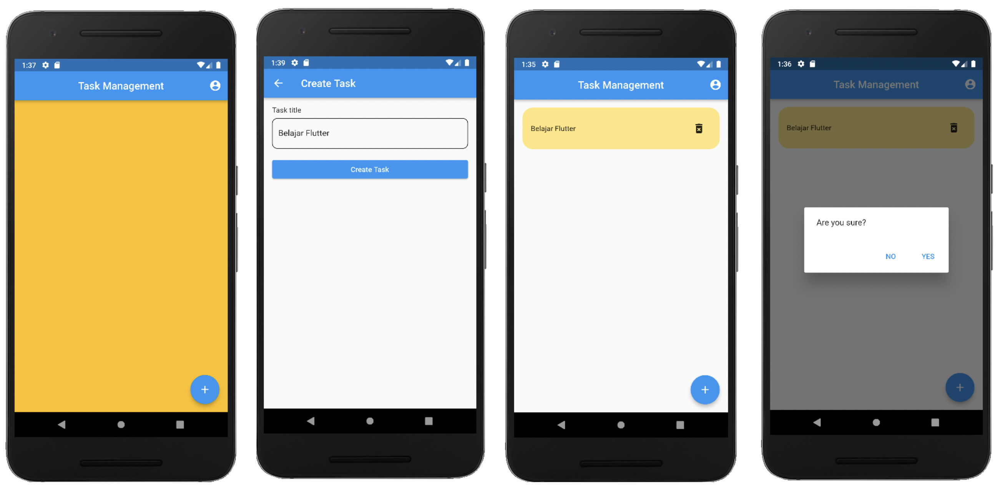
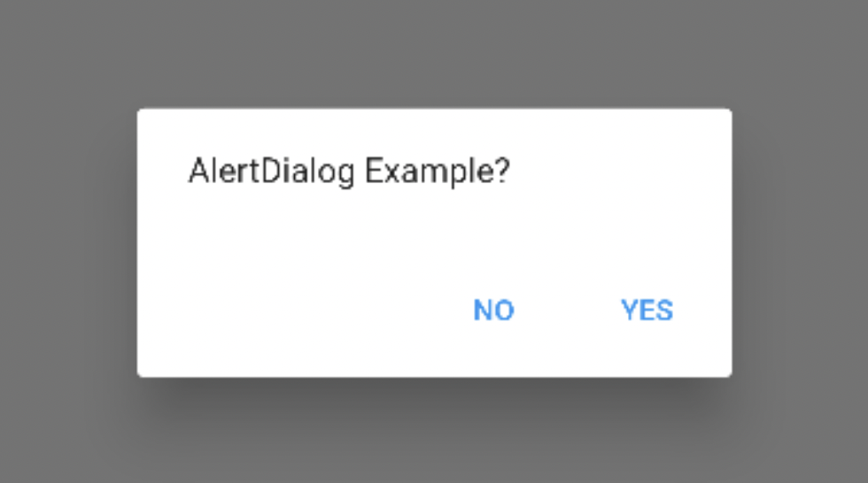
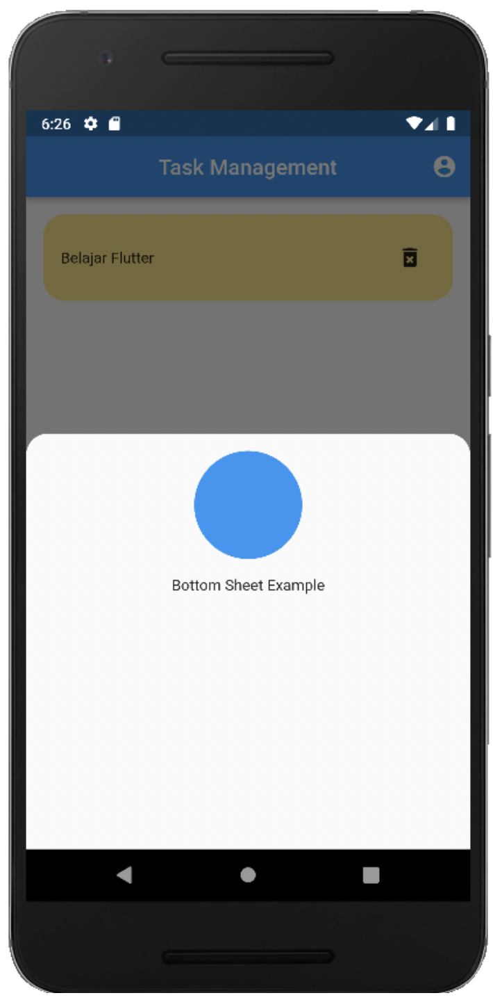

# **(19) Dialog Bottom Sheet**

## Nama: Akhmad Nur Alamsyah
&nbsp;

# Aplikasi Task Management


Menambahkan dan Menghapus kegiatan. 

&nbsp;

# Alert Dialog


Alert dialog untuk tampilan android, dari material design. Alert dialog membutuhkan helper method showDialog. Alert dialog menginformasikan pengguna tentang situasi tertentu dan bisa digunakan untuk mendapatkan input dari user.

# Bottom Sheet


Bottom sheet seperti dialog tetapi muncul dari bawah layar aplikasi. Bottom sheet menggunakan fungsi bawaan flutter showModalBottomSheet dan membutuhkan dua properti, yaitu context dan builder.

&nbsp;
# Code
* **Dependencies**

    Tambah dependency provider dan uuid.

* **main.dart**
    ```
    import 'package:flutter/material.dart';
    import 'package:provider/provider.dart';
    import 'package:task_management_2/models/task_manager.dart';
    import 'screens/task_screen.dart';

    void main() {
    runApp(const MyApp());
    }

    class MyApp extends StatelessWidget {
    const MyApp({Key? key}) : super(key: key);

    @override
    Widget build(BuildContext context) {
        return MultiProvider(
        providers: [
            ChangeNotifierProvider(
            create: (context) => TaskManager(),
            ),
        ],
        child: const MaterialApp(
            debugShowCheckedModeBanner: false,
            title: 'Task Management',
            home: TaskScreen(),
        ),
        );
    }
    }
    ```

&nbsp;
## **Folder components**
* **profile_sheet.dart**
    ```
    import 'package:flutter/material.dart';

    class ProfileSheet extends StatelessWidget {
    const ProfileSheet({Key? key}) : super(key: key);

    @override
    Widget build(BuildContext context) {
        return Padding(
        padding: const EdgeInsets.all(16),
        child: Column(
            children: [
            Container(
                height: 100,
                width: 100,
                decoration: const BoxDecoration(
                shape: BoxShape.circle,
                color: Colors.blue,
                ),
            ),
            const SizedBox(
                height: 16,
            ),
            const Text('Andre'),
            ],
        ),
        );
    }
    }
    ```

* **task_item_card.dart**
    ```
    import 'package:flutter/material.dart';
    import 'package:task_management_2/models/task_model.dart';

    class TaskItemCard extends StatelessWidget {
    final TaskModel task;
    final Function() onPressed;

    const TaskItemCard({
        Key? key,
        required this.task,
        required this.onPressed,
    }) : super(key: key);

    @override
    Widget build(BuildContext context) {
        return Container(
        padding: const EdgeInsets.all(16),
        decoration: BoxDecoration(
            color: Colors.amberAccent[100],
            borderRadius: BorderRadius.circular(
            20,
            ),
        ),
        child: Row(
            mainAxisAlignment: MainAxisAlignment.spaceBetween,
            children: [
            Text(task.taskName),
            IconButton(
                onPressed: () {
                showDialog(
                    context: context,
                    builder: (context) => AlertDialog(
                    content: const Text('Are you sure?'),
                    actions: [
                        TextButton(
                        onPressed: () {
                            Navigator.pop(context);
                        },
                        child: const Text('NO'),
                        ),
                        TextButton(
                        onPressed: onPressed,
                        child: const Text('YES'),
                        ),
                    ],
                    ),
                );
                },
                icon: const Icon(Icons.delete_forever_rounded),
            ),
            ],
        ),
        );
    }
    }
    ```

&nbsp;
## **Folder models**
* **task_manager.dart**
    ```
    import 'package:flutter/cupertino.dart';
    import 'task_model.dart';

    class TaskManager extends ChangeNotifier {
    final _taskModels = <TaskModel>[];
    List<TaskModel> get taskModels => List.unmodifiable(_taskModels);

    void deleteTask(int index) {
        _taskModels.removeAt(index);
        notifyListeners();
    }

    void addTask(TaskModel task) {
        _taskModels.add(task);
        notifyListeners();
    }
    }
    ```
* **task_model.dart**
    ```
    class TaskModel {
    final String id;
    final String taskName;

    TaskModel({
        required this.id,
        required this.taskName,
    });
    }
    ```

&nbsp;
## **Folder screen**
* **empty_task_screen.dart**
    ```
    import 'package:flutter/material.dart';

    class EmptyTaskScreen extends StatelessWidget {
    const EmptyTaskScreen({Key? key}) : super(key: key);

    @override
    Widget build(BuildContext context) {
        return Container(color: Colors.amber);
    }
    }
    ```
* **task_item_screen.dart**
    ```
    import 'package:flutter/material.dart';
    import 'package:task_management_2/models/task_model.dart';
    import 'package:uuid/uuid.dart';

    class TaskItemScreen extends StatefulWidget {
    final Function(TaskModel) onCreate;
    const TaskItemScreen({
        Key? key,
        required this.onCreate,
    }) : super(key: key);

    @override
    _TaskItemScreenState createState() => _TaskItemScreenState();
    }

    class _TaskItemScreenState extends State<TaskItemScreen> {
    final _taskNameController = TextEditingController();
    String _taskName = '';
    @override
    void initState() {
        super.initState();
        _taskNameController.addListener(() {
        setState(() {
            _taskName = _taskNameController.text;
        });
        });
    }

    @override
    void dispose() {
        _taskNameController.dispose();
        super.dispose();
    }

    @override
    Widget build(BuildContext context) {
        return Scaffold(
        appBar: AppBar(
            title: const Text('Create Task'),
        ),
        body: Padding(
            padding: const EdgeInsets.all(16),
            child: ListView(
            children: [
                // buildTaskNameField
                buildNameField(),
                const SizedBox(
                height: 16,
                ),
                // buildButton
                buildButton(),
            ],
            ),
        ),
        );
    }

    Widget buildNameField() {
        return Column(
        crossAxisAlignment: CrossAxisAlignment.start,
        children: [
            const Text('Task title'),
            const SizedBox(
            height: 8,
            ),
            TextField(
            controller: _taskNameController,
            cursorColor: Colors.black,
            decoration: const InputDecoration(
                hintText: 'E.g. study',
                enabledBorder: OutlineInputBorder(
                borderSide: BorderSide(color: Colors.black),
                borderRadius: BorderRadius.all(
                    Radius.circular(10),
                ),
                ),
                focusedBorder: OutlineInputBorder(
                borderSide: BorderSide(color: Colors.black),
                borderRadius: BorderRadius.all(
                    Radius.circular(10),
                ),
                ),
            ),
            )
        ],
        );
    }

    Widget buildButton() {
        return ElevatedButton(
        child: const Text('Create Task'),
        onPressed: () {
            final taskItem = TaskModel(
            id: const Uuid().v1(),
            taskName: _taskNameController.text,
            );
            widget.onCreate(taskItem);
        },
        );
    }
    }
    ```
* **task_list_screen.dart**
    ```
    import 'package:flutter/material.dart';
    import 'package:task_management_2/components/task_item_card.dart';
    import 'package:task_management_2/models/task_manager.dart';

    class TaskListScreen extends StatelessWidget {
    final TaskManager manager;
    const TaskListScreen({
        Key? key,
        required this.manager,
    }) : super(key: key);

    @override
    Widget build(BuildContext context) {
        final taskItems = manager.taskModels;
        return Padding(
        padding: const EdgeInsets.all(16),
        child: ListView.separated(
            itemCount: taskItems.length,
            itemBuilder: (context, index) {
            final item = taskItems[index];
            return TaskItemCard(
                key: Key(item.id),
                task: item,
                onPressed: () {
                manager.deleteTask(index);
                Navigator.pop(context);
                ScaffoldMessenger.of(context).showSnackBar(
                    SnackBar(content: Text('${item.taskName} Deleted')),
                );
                },
            );
            },
            separatorBuilder: (context, index) {
            return const SizedBox(
                height: 16,
            );
            },
        ),
        );
    }
    }
    ```
* **task_screen.dart**
    ```
    import 'package:flutter/material.dart';
    import 'package:provider/provider.dart';
    import 'package:task_management_2/components/profile_sheet.dart';
    import 'package:task_management_2/models/task_manager.dart';
    import 'package:task_management_2/screens/task_list_screen.dart';

    import 'empty_task_screen.dart';
    import 'task_item_screen.dart';

    class TaskScreen extends StatelessWidget {
    const TaskScreen({Key? key}) : super(key: key);

    @override
    Widget build(BuildContext context) {
        return Scaffold(
        appBar: AppBar(
            title: const Text('Task Management'),
            centerTitle: true,
            actions: [
            IconButton(
                onPressed: () {
                showModalBottomSheet(
                    shape: const RoundedRectangleBorder(
                    borderRadius: BorderRadius.vertical(
                        top: Radius.circular(20),
                    ),
                    ),
                    context: context,
                    builder: (context) => const ProfileSheet(),
                );
                },
                icon: const Icon(Icons.account_circle),
            ),
            ],
        ),

        floatingActionButton: FloatingActionButton(
            child: const Icon(Icons.add),
            onPressed: () {
            final manager = Provider.of<TaskManager>(context, listen: false);
            Navigator.push(
                context,
                MaterialPageRoute(
                builder: (context) => TaskItemScreen(
                    onCreate: (task) {
                    manager.addTask(task);
                    Navigator.pop(context);
                    },
                ),
                ),
            );
            },
        ),
        body: buildTaskScreen(),
        );
    }

    Widget buildTaskScreen() {
        return Consumer<TaskManager>(
        builder: (context, manager, child) {
            if (manager.taskModels.isNotEmpty) {
            return TaskListScreen(
                manager: manager,
            );
            } else {
            return const EmptyTaskScreen();
            }
        },
        );
    }
    }
    ```